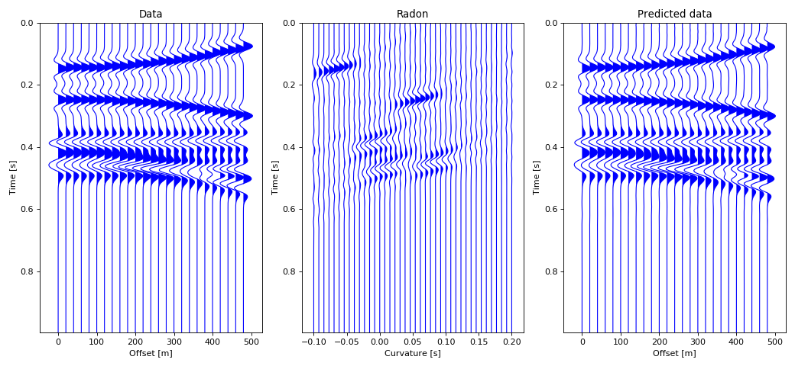

# RadonPy

## Parabolic Radon Transform

Time domain Parabolic Radon transform solution via the Conjugate Gradient method with implicit forward and adjoint Radon operators.
The Radon domain coefficients $m(\tau,p)$ are found by minimizing the following quadratic cost function

$$J =\| Lm - d \|_2^2 + \mu \| m \|_2^2$$
​
The seismic gather is given by $d(t,x)$, and $L$ provides the Radon forward operator in implicit form. The scalar $\mu$ is the trade-off parameter of the problem.
Notice that CG requires the operator $L$ (Forward) and $L′$ it adjoint (or transpose operator). Check `radon_forward` and `radon_adjoint` in `radon_lib.py`

The implicit form operators are given by

$$ d = L m \quad \equiv \quad d(t,x) = \sum_q m(t-q x^2,x) $$

$$ m' = L' d \quad \equiv \quad m'(\tau,q) = \sum_x d(\tau+q x^2,x) $$

The parameter $q x^2$ is replaced by $q (x/x_{max})^2$. Then, the variable $q$ is residual moveout at far offset and it is measured in seconds.

to run the program use: `python main.py`. You will first need to install  the following libraries `numba`, `numpy` and `matplotlib`.

*Reference:* D Trad, T Ulrych, M Sacchi, 2003, Latest views of the sparse Radon transform: Geophysics 68 (1), 386-399.
